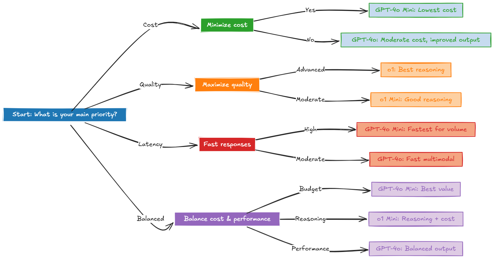

# **Balancing LLM Costs, Performance Quality & Latency**

---

When planning AI solutions at scale, three metrics often determine success: 

* cost
* quality
* and latency

Based on the Work from this Article

https://www.linkedin.com/pulse/pragmatic-approach-openai-model-selection-farzad-sunavala-en39e/

---

### GPT-4o Mini
* Cost: Lowest ($0.15 per 1M input tokens, $0.60 per 1M output tokens)
* Relative Cost: Baseline (1×). Processing 1M tokens costs $0.75 total ($0.15 + $0.60).
* Key Features: Basic multimodal support (text + vision) in a compact, cost-efficient package.
* Trade-Off: Reduced reasoning depth for dramatic savings.
Ideal For: Small business use cases, low-stakes tasks, or large-scale, cost-focused experimentation.

Example:  
A local coffee shop automates a chat assistant for FAQs—like store hours, menu items, and promotions. Their limited budget means even a modest AI spend can be significant. GPT-4o Mini’s low cost and basic vision capabilities let the shop display menu images if needed, without risking a big bill.

---
### Why This GPT-4o Mini?

* Minimal Reasoning Needs: Straightforward Q&A suffices.
* Cost Efficiency: Extremely low rates keep the budget under control.
* Basic Multimodal Support: Perfect for quick menu image references, if desired.

---

### GPT-4o
* Cost: Moderate ($2.50 per 1M input tokens, $10 per 1M output tokens)
* Relative Cost: ~17× GPT-4o Mini. Processing 1M tokens costs $12.50 total ($2.50 + $10).
* Key Features: Strong multimodal capabilities (text, vision) plus better quality than Mini for complex tasks.
* Trade-Off: Higher cost but more robust generation and analysis.
Ideal For: Customer-facing eCommerce or mid-level enterprise use cases where reliability and moderate reasoning matter.

Example: 
An online retailer’s chatbot handles both text inquiries and product image references. The company can’t risk an inaccurate or slow agent leading to abandoned carts. GPT-4o offers a balance & more accessible price than high-end reasoning models like o1.

---
### Why GPT-4o?

* Better Multimodality: Handles both text and images for product queries.
* Balanced Cost/Performance: A step up from GPT-4o Mini without o1’s premium price tag.
* Suitable for Real-Time: Quick enough for conversational eCommerce interactions.

---

### o1 Mini
* Cost: Moderate-High ($3 per 1M input, $12 per 1M output)
* Relative Cost: ~20× GPT-4o Mini. Processing 1M tokens costs $15 total ($3 + $12).
* Key Features: Advanced chain-of-thought reasoning—though somewhat lighter than full o1—making it more cost-efficient for deeper tasks (math, coding, logic).
* Trade-Off: More expensive than GPT-4o series but cheaper than full o1.
* Ideal For: Consulting agencies, mid-sized businesses with non-trivial reasoning demands.

#### Example: 
A consulting firm generates detailed analyses or custom code snippets for client projects. They need advanced reasoning—like logic-based recommendations or math calculations—beyond GPT-4o’s comfort zone but can’t justify o1’s premium pricing for every request.

--- 
### Why o1 Mini?

* Chain-of-Thought: Provides better structure for complex queries than GPT-4o.
* Reasonable Costs: A fraction of o1’s total cost, making it feasible for repeated use.
* Versatile: Handles math and coding tasks with fewer errors than purely multimodal-focused models.

---

### o1
* Cost: Highest ($15 per 1M input, $60 per 1M output)
* Relative Cost: ~100× GPT-4o Mini. Processing 1M tokens costs $75 total ($15 + $60).
* Key Features: Premium chain-of-thought reasoning, ideal for complex coding, mathematics, and advanced R&D.
* Trade-Off: Top-tier logic at a premium cost.
Ideal For: Mission-critical scenarios (healthcare, finance, aerospace) where errors can be catastrophic.

#### Example: 
A medical center uses AI to cross-reference patient data, medication records, and clinical research for prescriptions. An incorrect dosage could risk lives, so near-perfect accuracy is worth the premium cost.

---
### Why o1?

* Superior Accuracy: Chain-of-thought logic significantly reduces mistakes in complex scenarios.
* Mission-Critical: Justifies the higher price when errors carry high financial or human risk.
* High-End Performance: Perfect for advanced data analytics, deep research, or extensive code generation.

---
### Quality Considerations
* Terms like “good” or “excellent” are subjective. The best approach to evaluating an AI model’s quality is:

* Define Your Use Case: Quick FAQs or data-driven medical research?
* Establish Internal Benchmarks: Test each model on your own data to measure accuracy.
Set Acceptable Error Rates: Some mistakes might be tolerable; others are simply not an option.

---
### Model-Specific Quality Notes:

* GPT-4o Mini: Good for standard tasks, basic multimodal.
* GPT-4o: Excellent multimodal output, stronger text/image integration.
* o1 Mini: Very good reasoning (math, coding, scientific tasks).
* o1: Superior chain-of-thought reasoning.

---

### Latency Considerations
Even the best model loses value if users abandon an interaction due to slow responses. Here’s how each model stacks up:

* GPT-4o Mini: Fast, optimized for quick turnarounds.
* GPT-4o: Similar to Mini for text; slightly more overhead for vision tasks.
* o1 Mini: Generally quick for a reasoning model, but slower under heavy logic tasks.
* o1: Moderate; chain-of-thought can add compute time.

---

## Simplified Decision Framework

For teams needing a quick path to model selection, ask these two questions:

* Is cost your primary constraint?
* Do you need advanced reasoning?

---

### Summary of Decisions

---

## Thank you
